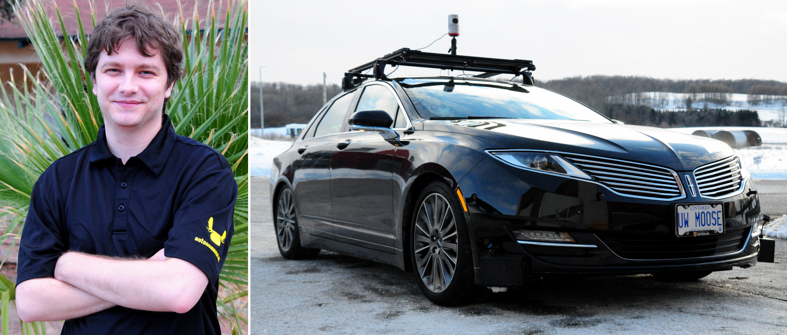
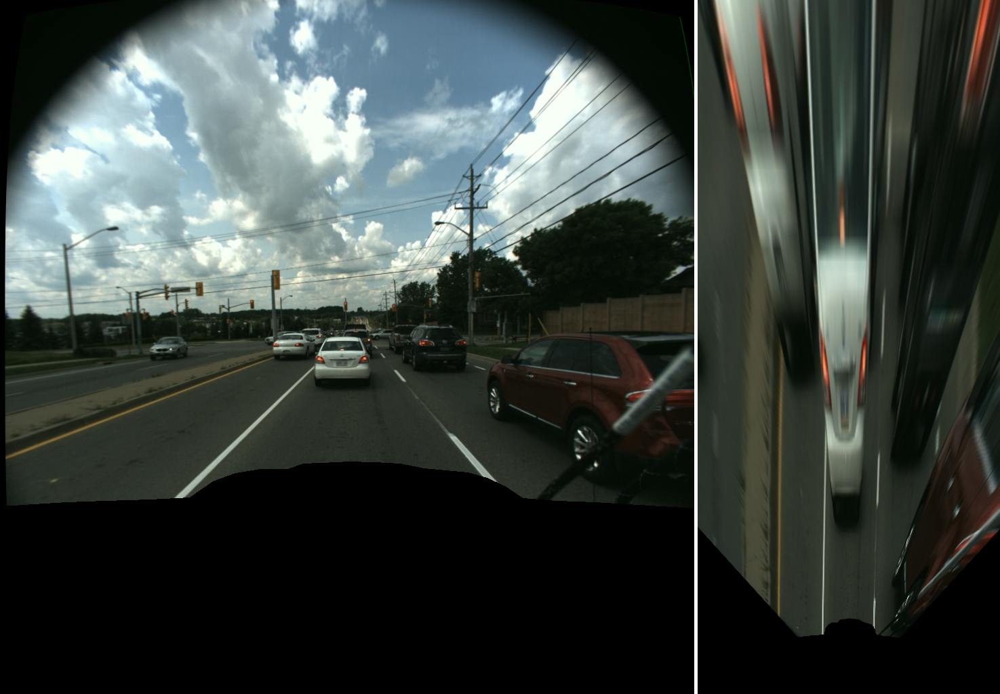
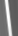
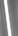
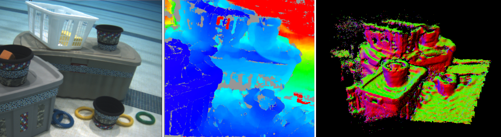

# Michael Smart, BASc., MASc.

## About Me

I am currently the Software Lead and a Perception Analyst with
[Autonomoose](https://www.autonomoose.net/), the University of Waterloo's
premier self-driving car project and one of the first of its kind to be testing
in real Canadian environments. Our software was also showcased at CES twice
(2017, 2018) comprising the full autonomy stack of the demo in partnership with
[Renesas](http://renesasatces.com/).

I completed my BASc in Systems Design Engineering from the University of
Waterloo in 2012 with a minor in German, having spent my third year on exchange
at [TUBS](https://www.tu-braunschweig.de/index.html). My undergraduate areas of
focus were control systems, signal processing, and robot dynamics. In 2016 I
completed my MASc in Mechanical and Mechatronics Engineering under the
supervision of Prof. Steven Waslander with the thesis "*[Robust Bayesian
Detection and Tracking of Lane Boundary Markings for Autonomous
Driving](https://uwspace.uwaterloo.ca/handle/10012/10454)*". My graduate areas
of focus were computer vision, robot perception, and autonomous vehicles.

- My github: https://github.com/michaelhsmart (most of our work is private, sorry!)
- My email: michaelsmart [at] uwaterloo [dot] ca

## Current Projects

### Autonomoose

For [Autonomoose](https://www.autonomoose.net/) I currently own a few
longer-term projects:

#### Coordinate Frame / TF Design

I'm redesigning our coordinate frame and transform system to follow REP-105
conventions for distributed responsibility of transform estimation. Between all
of the different map and sensor frames, there are over 20 frames in the stack -
making it a nice challenge!

#### Path Planner Rewrite

Our previous path planner originated as pure research code, with most of the
package contained within a single 7k+ LOC class. I'm now refactoring and largely
rewriting the code to follow proper OOP practices so that it can be reusable and
integrate more easily with newly developed modules or with our industry
partners' software and requirements.

## Publications

2017: **Smart, M.**, Vaishnav, S., and Waslander, S., ["*Real-Time Robust Lane
Marking Detection and Tracking for Degraded Lane
Markings,*"](https://www.sae.org/publications/technical-papers/content/2017-01-0043/)
SAE Technical Paper 2017-01-0043, 2017

2015: **M. Smart** and S. L. Waslander, ["*Stereo Augmented Detection of Lane
Marking Boundaries,*"](https://ieeexplore.ieee.org/document/7313493/) 2015 IEEE
18th International Conference on Intelligent Transportation Systems, Las Palmas,
2015

2013: J. Servos, **M. Smart** and S. L. Waslander, [*"Underwater stereo SLAM
with refraction correction,"*](https://ieeexplore.ieee.org/document/6696833/)
2013 IEEE/RSJ International Conference on Intelligent Robots and Systems, Tokyo,
2013

## Past Projects

#### ULMA

After completing my MASc I worked as a research associate over the summer
leading a small team to convert my thesis algorithms from MATLAB to ROS/C++ for
real-time testing by an industry partner located in Michigan. The team consisted
of myself and two co-op students and the goal was to achieve real-time
performance (~10Hz) and demonstrate that the algorithms developed in my thesis
could generalize well to markings that differed from those contained in the
training dataset.

By the end of the summer, we were able to demonstrate comparable performance
even though the system had been trained in a different region. The only notable
failures were misdetections in areas where the lane markings had opposite
colouring (dark markings against a light background) which was not a feature I
had ever seen before and was not in the training set. I presented our published
results at [SAE World Congress
2017](https://www.sae.org/publications/technical-papers/content/2017-01-0043/).

The video below shows the results of running ULMA on the dataset from my thesis.
Note that the video frames were recorded at 3Hz for the dataset due to HDD
throughput limitations. ULMA can perform at ~10Hz.

<iframe width="560" height="315" src="https://www.youtube.com/embed/tBPPhn14g1M" frameborder="0" allow="autoplay; encrypted-media" allowfullscreen></iframe>

Outstanding challenges left for future work are:
*  Curbs do not exist in the model, so it frequently detects curbs as lane markings
*  The model could be extended to other marking configurations, such as intersections

#### Thesis

[Robust Bayesian Detection
and Tracking of Lane Boundary Markings for Autonomous
Driving](https://uwspace.uwaterloo.ca/handle/10012/10454)

My thesis focused on the problem of how we can detect lane markings in
environments where winter degrades the markings to the edge of
visibility, such as here in Canada.

The key challenges that needed to be addressed were:

1. There was no dataset covering reduced quality lane markings.
2. Most methods can produce dangerous false detections when markings are poor or missing.
3. Training typically requires data to be labelled.

Challenge 1 was addressed by gathering a data set covering a wide range of
marking qualities around the Waterloo Region. This was accomplished using a
[Multisense S7S](https://carnegierobotics.com/multisense-s7/) stereo camera.

At the time of writing my thesis, the proposed state-of-the-art approach to
challenge 2 required a training process that was unreliable for more general
applications and required labelled data.

I was able to resolve both challenges 2 and 3 by entirely rewriting the
training process for the existing method from scratch. I had the key idea to use
[EM](https://en.wikipedia.org/wiki/Expectation%E2%80%93maximization_algorithm)
with the missing data labels as latent variables, which allowed the system to be
trained without requiring any labels at all. This would conventionally suffer
from mode collapse and model identifiability challenges, but I was also able to
demonstrate that by providing extremely weak prior parameter distributions, the
EM-trained models would not display either of these weaknesses.

The final contribution of my thesis was demonstrating the importance of using 3D
information prior to applying a homography transform to obtain a Bird's Eye View
image. Out-of-plane features, such as cars or signs, often get stretched out in
line-like streaks that resemble lane markings as shown below:

Testing my methods against the [KITTI Roads
dataset](http://www.cvlibs.net/datasets/kitti/eval_road.php), I was able to
demonstrate that applying a stereo-based height threshold to pre-filter the
image dramatically improved the safety of the system by eliminating false lane
marking features with a **95.5%** Negative Predictive Value. Investigation
revealed that the system had difficulty learning to classify the out-of-plane
features. As even a trained human observer can struggle to classify such
features at a local level (see below), the best solution is to incorporate
information beyond what the BEV provides, such as 3D from stereo vision, before
leaving an algorithm to struggle to learn it.

Above: One is a signpost, the other is a lane marking

The resulting system can be trained on unlabelled data and demonstrated a very
low false-detection rate (**~90%** precision) on real-world data. This work was
later converted to real-time performance as the ULMA project (see above).

#### Underwater Stereo SLAM with Refraction Correction

Between my BASc and MASc, I worked as a Research Assistant for my soon-to-be
MASc supervisor, Prof Steven Waslander, on a fascinating project to perform
vision-based Stereo SLAM underwater. In addition to the mechanical difficulties
of dealing with underwater environments, underwater stereo vision is
particularly difficult because of the refraction that occurs at the boundary
between the medium containing the camera (often air) and the medium containing
the scene (water).

As refraction is a nonlinear process, significant refraction requires revisiting
all of the geometry involved in conventional stereo vision. We were able to
correct for the refraction-induced distortions using a physics-based model in
which epipolar lines become epipolar curves. This work culminated in a
publication presented at [IROS
2013](http://ieeexplore.ieee.org/document/6696833/). My primary contribution to
the work was my research on the refractive projection of images, the generation
and reprojection of epipolar curves, and the calibration method (sections II,
III, and IV).

Left: Image of the test scene, Middle: Refraction-corrected stereo depth image,
Right: View of resulting SLAM scene.
